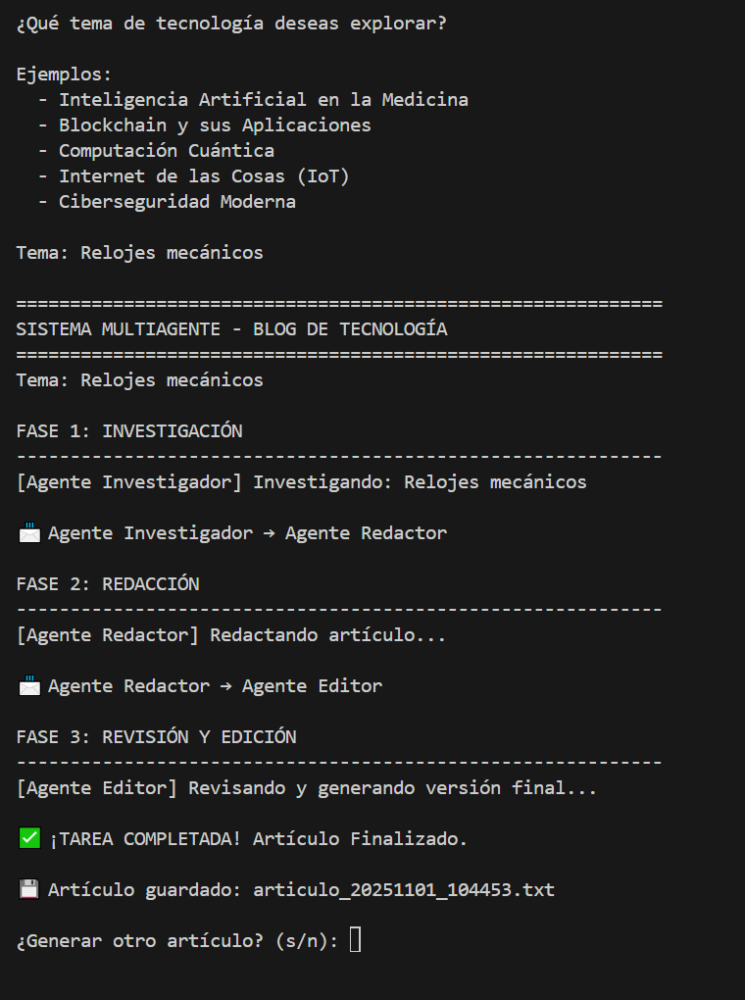
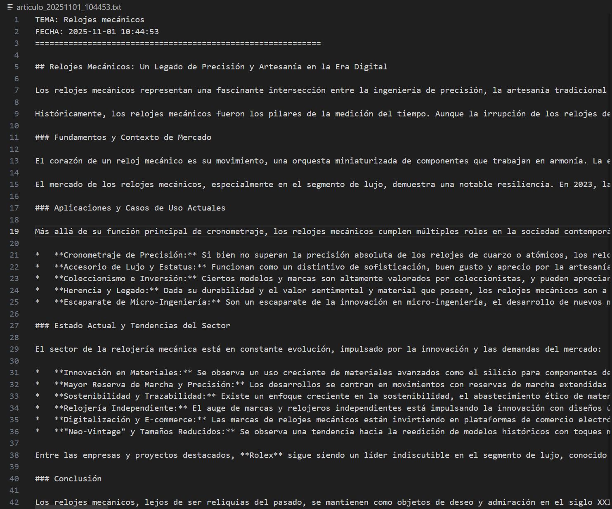
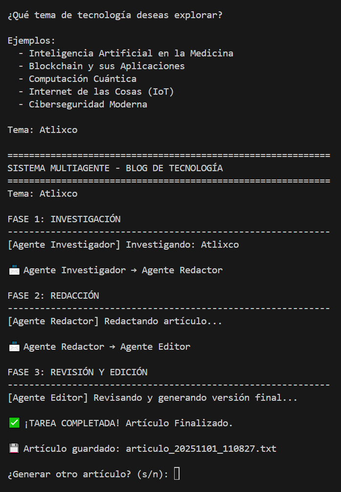
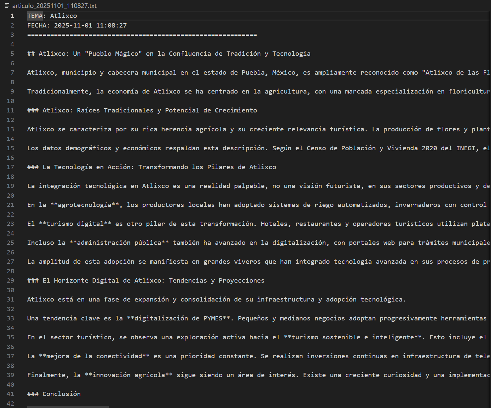

# Sistema Multiagente

## Datos generales del alumno

**Nombre:** Bernardo Bojalil Lorenzini
**Matrícula:** 195908 
**Curso:** Agentes Inteligentes  
**Período:** Otoño 2025  


## Introducción

Este proyecto implementa un sistema multiagente colaborativo diseñado para automatizar la creación de artículos técnicos sobre tecnología. El sistema está basado en una arquitectura horizontal donde tres agentes especializados (Investigador, Redactor y Editor) trabajan de manera coordinada mediante un sistema de mensajería descentralizado.

El objetivo principal es demostrar cómo múltiples agentes con roles específicos pueden colaborar eficientemente para completar una tarea compleja. Cada agente utiliza el modelo Gemini 2.5 Flash de Google para procesar información y generar contenido de calidad profesional. El sistema simula un flujo de trabajo editorial real, desde la investigación inicial hasta la publicación del artículo final.

## Desarrollo de la solución

### Sistema de mensajería entre agentes

El núcleo de la comunicación entre agentes se implementa mediante dos clases fundamentales que permiten el intercambio descentralizado de información:

```python
class MensajeAgente:
    """Representa un mensaje entre agentes"""
    def __init__(self, remitente: str, destinatario: str, contenido: str, tipo: str = "datos"):
        self.remitente = remitente
        self.destinatario = destinatario
        self.contenido = contenido
        self.tipo = tipo
        self.timestamp = datetime.now().isoformat()
    
    def to_dict(self):
        return {
            "remitente": self.remitente,
            "destinatario": self.destinatario,
            "tipo": self.tipo,
            "timestamp": self.timestamp
        }

class BuzonMensajes:
    """Sistema de mensajería descentralizado para comunicación entre agentes"""
    def __init__(self):
        self.mensajes: List[MensajeAgente] = []
        self.historial: List[Dict] = []
    
    def enviar_mensaje(self, remitente: str, destinatario: str, contenido: str, tipo: str = "datos"):
        mensaje = MensajeAgente(remitente, destinatario, contenido, tipo)
        self.mensajes.append(mensaje)
        self.historial.append(mensaje.to_dict())
        print(f"\n📨 {remitente} → {destinatario}")
        return mensaje
    
    def obtener_mensajes(self, destinatario: str) -> List[MensajeAgente]:
        mensajes_pendientes = [m for m in self.mensajes if m.destinatario == destinatario]
        self.mensajes = [m for m in self.mensajes if m.destinatario != destinatario]
        return mensajes_pendientes
    
    def guardar_historial(self, ruta: str = "historial_mensajes.json"):
        with open(ruta, "w", encoding="utf-8") as f:
            json.dump(self.historial, f, ensure_ascii=False, indent=2)
```

La clase `MensajeAgente` encapsula toda la información necesaria para la comunicación entre agentes. Cada mensaje contiene cuatro atributos principales: el nombre del agente que lo envía (remitente), el agente que debe recibirlo (destinatario), el contenido del mensaje (que puede ser texto extenso como datos de investigación o borradores completos), y un tipo que permite categorizar los mensajes (como "investigacion" o "borrador"). Adicionalmente, cada mensaje registra automáticamente la fecha y hora exacta en que fue creado mediante `timestamp`, lo cual es crucial para auditorías posteriores. El método `to_dict()` convierte el mensaje a un diccionario que puede ser serializado a JSON para su almacenamiento permanente.

La clase `BuzonMensajes` actúa como el canal de comunicación central del sistema. Mantiene dos estructuras de datos: una lista de mensajes activos que aún no han sido procesados por sus destinatarios, y un historial completo de todos los mensajes que se han enviado durante la ejecución. El método `enviar_mensaje()` crea un nuevo objeto `MensajeAgente`, lo añade a la cola de mensajes pendientes y simultáneamente lo registra en el historial permanente. Además, imprime en consola una notificación visual del flujo de información entre agentes. El método `obtener_mensajes()` implementa un patrón de consumo de mensajes: busca todos los mensajes dirigidos a un agente específico, los extrae de la cola de pendientes (eliminándolos para evitar procesamiento duplicado), y los devuelve al agente solicitante. Finalmente, `guardar_historial()` persiste todo el registro de comunicaciones en un archivo JSON, permitiendo análisis posterior del flujo de trabajo completo.

### Clase base para agentes

Todos los agentes del sistema heredan de una clase base que estandariza su comportamiento y proporciona la infraestructura común necesaria:

```python
class AgenteBase:
    """Clase base para todos los agentes del sistema"""
    def __init__(self, nombre: str, rol: str, buzon: BuzonMensajes, temperature: float = 0.3):
        self.nombre = nombre
        self.rol = rol
        self.buzon = buzon
        self.llm = ChatGoogleGenerativeAI(
            model="gemini-2.5-flash",
            temperature=temperature,
            google_api_key=google_key,
        )
    
    def log(self, mensaje: str):
        print(f"[{self.nombre}] {mensaje}")
    
    def enviar_mensaje(self, destinatario: str, contenido: str, tipo: str = "datos"):
        return self.buzon.enviar_mensaje(self.nombre, destinatario, contenido, tipo)
    
    def recibir_mensajes(self) -> List[MensajeAgente]:
        return self.buzon.obtener_mensajes(self.nombre)
```

El constructor de `AgenteBase` inicializa cuatro componentes esenciales para cada agente. Primero, asigna un nombre único y una descripción de rol que identifican al agente en el sistema. Segundo, guarda una referencia al buzón de mensajes compartido, estableciendo la conexión del agente con el sistema de comunicación. Tercero, y más importante, crea una instancia del modelo de lenguaje Gemini 2.5 Flash mediante LangChain, configurándolo con un parámetro `temperature` que controla la creatividad vs. determinismo de las respuestas del modelo. Una temperatura más baja produce respuestas más consistentes y predecibles, mientras que valores más altos generan respuestas más variadas y creativas.

El método `log()` proporciona una forma estandarizada de imprimir mensajes en consola, anteponiendo el nombre del agente entre corchetes para facilitar el seguimiento de qué agente está ejecutando cada acción. Los métodos `enviar_mensaje()` y `recibir_mensajes()` son wrappers convenientes que abstraen la interacción con el buzón de mensajes: el primero automáticamente incluye el nombre del agente como remitente, mientras que el segundo solicita mensajes dirigidos específicamente a ese agente. Esta abstracción permite que cada agente especializado se enfoque en su lógica de negocio sin preocuparse por los detalles de la comunicación.

### Agente Investigador

El primer agente del flujo de trabajo se especializa en la recopilación y estructuración de información sobre temas tecnológicos:

```python
class ResearchAgent(AgenteBase):
    def __init__(self, buzon: BuzonMensajes):
        super().__init__("Agente Investigador", "Experto en búsqueda de información", buzon, temperature=0.3)
        self.prompt_template = PromptTemplate(
            input_variables=["tema"],
            template="""
Eres un investigador de tecnología. Busca información objetiva y actual sobre el tema solicitado.

TEMA: {tema}

Proporciona:
1. Definición y contexto del tema (2 párrafos)
2. Datos y estadísticas relevantes (3-5 puntos)
3. Aplicaciones prácticas actuales
4. Tendencias y desarrollos recientes
5. Empresas o proyectos destacados

Sé objetivo, conciso y preciso. Enfócate en hechos verificables.
"""
        )
    
    def investigar(self, tema: str) -> str:
        self.log(f"Investigando: {tema}")
        chain = self.prompt_template | self.llm | StrOutputParser()
        datos_encontrados = chain.invoke({"tema": tema})
        self.enviar_mensaje("Agente Redactor", datos_encontrados, tipo="investigacion")
        return datos_encontrados
```

El `ResearchAgent` hereda de `AgenteBase` y se inicializa con un nombre descriptivo, un rol que define su expertise, y una temperatura de 0.3 relativamente baja. Esta temperatura conservadora es intencional: queremos que el agente produzca información factual y consistente, no respuestas creativas o especulativas. El corazón del agente es su `prompt_template`, un objeto de LangChain que define cómo se comunica con el modelo de lenguaje. Este template utiliza una variable de entrada `{tema}` que será reemplazada dinámicamente con el tema específico que se desea investigar. El prompt está cuidadosamente estructurado en cinco secciones específicas, solicitando al LLM que actúe como un investigador profesional que recopila definiciones, datos cuantificables, aplicaciones reales, tendencias emergentes y actores relevantes en el campo. La instrucción final enfatiza objetividad y precisión, orientando al modelo hacia respuestas basadas en hechos.

El método `investigar()` ejecuta el proceso de investigación completo. Primero registra en consola qué tema está siendo investigado mediante el método `log()`. Luego construye una cadena de procesamiento usando el operador pipe de LangChain: el template genera el prompt completo, este se envía al modelo de lenguaje (`self.llm`), y finalmente el `StrOutputParser()` extrae la respuesta como texto plano. Al invocar esta cadena con el diccionario `{"tema": tema}`, el placeholder en el template se reemplaza con el tema real y el LLM genera la investigación. Los datos obtenidos se envían inmediatamente al siguiente agente en el flujo (Agente Redactor) mediante el sistema de mensajería, marcándolos con el tipo "investigacion" para que el receptor sepa cómo procesarlos. Finalmente, el método retorna los datos para permitir validaciones o usos adicionales.

### Agente Redactor

El segundo agente transforma la información estructurada en un artículo narrativo bien escrito:

```python
class WriterAgent(AgenteBase):
    def __init__(self, buzon: BuzonMensajes):
        super().__init__("Agente Redactor", "Experto en redacción técnica", buzon, temperature=0.4)
        self.prompt_template = PromptTemplate(
            input_variables=["datos_investigacion"],
            template="""
Eres un redactor técnico. Escribe un artículo de blog claro y objetivo basado en los datos proporcionados.

DATOS DE INVESTIGACIÓN:
{datos_investigacion}

ESTRUCTURA:
1. Título descriptivo
2. Introducción (2 párrafos): qué es y por qué es importante
3. Sección 1: Fundamentos y contexto
4. Sección 2: Aplicaciones y casos de uso
5. Sección 3: Estado actual y tendencias
6. Conclusión: resumen y perspectiva

ESTILO:
- Tono profesional e informativo
- Párrafos cortos y directos
- Enfoque en hechos y datos
- Evita lenguaje promocional o especulativo
- 700-900 palabras

Genera el borrador completo del artículo.
"""
        )
    
    def redactar(self, datos: str) -> str:
        self.log("Redactando artículo...")
        chain = self.prompt_template | self.llm | StrOutputParser()
        borrador_articulo = chain.invoke({"datos_investigacion": datos})
        self.enviar_mensaje("Agente Editor", borrador_articulo, tipo="borrador")
        return borrador_articulo
    
    def procesar_mensajes(self):
        mensajes = self.recibir_mensajes()
        for mensaje in mensajes:
            if mensaje.tipo == "investigacion":
                return self.redactar(mensaje.contenido)
        return None
```

El `WriterAgent` se inicializa con una temperatura de 0.4, ligeramente más alta que el investigador. Este ajuste es estratégico: queremos mantener precisión factual pero permitir algo más de flexibilidad lingüística y creatividad en la estructura narrativa del artículo. El prompt template está diseñado para recibir los datos de investigación completos y transformarlos en un artículo estructurado. Especifica una arquitectura clara de seis secciones que van desde un título atractivo hasta una conclusión sintética. Las instrucciones de estilo son detalladas: establecen el tono profesional, prohíben explícitamente el lenguaje promocional o especulativo (común en blogs de tecnología de baja calidad), y definen un rango de longitud objetivo de 700-900 palabras que equilibra profundidad con legibilidad.

El método `redactar()` implementa la lógica de transformación. Registra su actividad en consola, construye la cadena de procesamiento LangChain idéntica a la del investigador (pero con un template diferente), invoca el LLM pasándole los datos de investigación, y recibe un borrador completo del artículo. Este borrador se envía inmediatamente al Agente Editor marcado con el tipo "borrador", continuando el flujo del pipeline.

El método `procesar_mensajes()` implementa un patrón crítico en arquitecturas de mensajería: el consumo selectivo de mensajes. Este método recupera todos los mensajes pendientes para el agente, itera sobre ellos, y procesa únicamente aquellos marcados como "investigacion" (ignorando cualquier otro tipo). Esto hace que el agente sea robusto: si por alguna razón recibe mensajes de tipos inesperados, simplemente los ignora. Al encontrar un mensaje de investigación, llama al método `redactar()` con el contenido del mensaje y retorna el resultado. Si no hay mensajes de investigación pendientes, retorna `None`, indicando que no hay trabajo por hacer.

### Agente Editor

El tercer agente realiza la revisión final y produce el artículo listo para publicación:

```python
class EditorAgent(AgenteBase):
    def __init__(self, buzon: BuzonMensajes):
        super().__init__("Agente Editor", "Experto en revisión y edición", buzon, temperature=0.2)
        self.prompt_template = PromptTemplate(
            input_variables=["borrador"],
            template="""
Eres un editor profesional. Revisa y mejora el borrador para producir la versión final.

BORRADOR:
{borrador}

TAREAS:
1. Corrige errores ortográficos y gramaticales
2. Mejora la claridad y coherencia
3. Verifica la estructura y flujo
4. Optimiza títulos y subtítulos
5. Asegura tono profesional consistente

IMPORTANTE: Genera ÚNICAMENTE el artículo final corregido y mejorado, sin comentarios adicionales.
No incluyas notas, resúmenes de cambios ni sugerencias. Solo el artículo listo para publicar.
"""
        )
    
    def revisar(self, borrador: str) -> str:
        self.log("Revisando y generando versión final...")
        chain = self.prompt_template | self.llm | StrOutputParser()
        articulo_final = chain.invoke({"borrador": borrador})
        print("\n✅ ¡TAREA COMPLETADA! Artículo Finalizado.")
        return articulo_final
    
    def procesar_mensajes(self):
        mensajes = self.recibir_mensajes()
        for mensaje in mensajes:
            if mensaje.tipo == "borrador":
                return self.revisar(mensaje.contenido)
        return None
```

El `EditorAgent` utiliza la temperatura más baja del sistema (0.2), maximizando la determinismo y consistencia en las correcciones. Un editor debe aplicar reglas gramaticales y de estilo de manera predecible, no experimentar con variaciones creativas. El prompt template está optimizado para revisión editorial profesional, enumerando cinco tareas específicas que van desde correcciones ortográficas básicas hasta verificación de coherencia estructural. La sección "IMPORTANTE" es crucial: instruye explícitamente al LLM para que NO genere metacontenido como "He corregido los siguientes errores..." o "Sugerencias de mejora...". Esto es necesario porque los LLMs tienden naturalmente a explicar sus acciones; aquí queremos únicamente el producto final pulido.

El método `revisar()` sigue el patrón establecido: registra su actividad, construye la cadena LangChain con el template de edición, procesa el borrador recibido, y genera el artículo final. Al completar, imprime un mensaje de éxito con el emoji de checkmark verde, proporcionando feedback visual claro de que el pipeline completo ha terminado exitosamente. El método `procesar_mensajes()` replica la lógica del Agente Redactor pero filtrando por mensajes tipo "borrador", manteniendo el patrón de consumo selectivo que hace robusto todo el sistema.

### Coordinador del sistema

La clase coordinadora orquesta la ejecución secuencial del pipeline completo y gestiona las salidas del sistema:

```python
class CoordinadorMultiagente:
    def __init__(self):
        self.buzon = BuzonMensajes()
        self.agente_investigador = ResearchAgent(self.buzon)
        self.agente_redactor = WriterAgent(self.buzon)
        self.agente_editor = EditorAgent(self.buzon)
    
    def generar_articulo(self, tema: str) -> str:
        print("\n" + "="*60)
        print(f"SISTEMA MULTIAGENTE - BLOG DE TECNOLOGÍA")
        print("="*60)
        print(f"Tema: {tema}\n")
        
        # FASE 1: Investigación
        print("FASE 1: INVESTIGACIÓN")
        print("-"*60)
        datos = self.agente_investigador.investigar(tema)
        
        # FASE 2: Redacción
        print("\nFASE 2: REDACCIÓN")
        print("-"*60)
        self.agente_redactor.procesar_mensajes()
        
        # FASE 3: Edición
        print("\nFASE 3: REVISIÓN Y EDICIÓN")
        print("-"*60)
        articulo_final = self.agente_editor.procesar_mensajes()
        
        if articulo_final:
            self._guardar_articulo(tema, articulo_final)
            self.buzon.guardar_historial()
            return articulo_final
        else:
            raise Exception("Error: No se pudo completar el artículo")
    
    def _guardar_articulo(self, tema: str, articulo: str):
        timestamp = datetime.now().strftime("%Y%m%d_%H%M%S")
        nombre_archivo = f"articulo_{timestamp}.txt"
        
        with open(nombre_archivo, "w", encoding="utf-8") as f:
            f.write(f"TEMA: {tema}\n")
            f.write(f"FECHA: {datetime.now().strftime('%Y-%m-%d %H:%M:%S')}\n")
            f.write("="*60 + "\n\n")
            f.write(articulo)
        
        print(f"\n💾 Artículo guardado: {nombre_archivo}")
```

El constructor del `CoordinadorMultiagente` inicializa todo el ecosistema de agentes. Primero crea una instancia única del buzón de mensajes que será compartida por todos los agentes, estableciendo el canal de comunicación común. Luego instancia cada uno de los tres agentes especializados pasándoles la referencia al buzón compartido. Este patrón de "inyección de dependencias" es fundamental: todos los agentes comparten el mismo buzón, lo que permite que los mensajes fluyan entre ellos de manera transparente.

El método `generar_articulo()` implementa el flujo de trabajo completo dividido en tres fases claramente delimitadas. Comienza imprimiendo un encabezado visual con el tema solicitado para proporcionar contexto claro en la consola. La Fase 1 activa directamente al agente investigador mediante su método `investigar()`, que internamente enviará sus resultados al redactor vía mensajería. La Fase 2 no llama a un método del redactor directamente, sino que invoca `procesar_mensajes()`, lo cual es sutilmente importante: el redactor busca activamente mensajes de tipo "investigacion" en su buzón, los encuentra (porque el investigador los envió en la fase anterior), y procesa el contenido. Este patrón desacopla a los agentes: el coordinador no necesita pasar datos explícitamente entre ellos. La Fase 3 replica este patrón con el editor procesando mensajes tipo "borrador".

Después de las tres fases, el método verifica que se haya generado un artículo final exitosamente. Si existe, llama a `_guardar_articulo()` para persistir el resultado y a `guardar_historial()` del buzón para registrar toda la comunicación entre agentes. Si algo falló y no hay artículo final, lanza una excepción explícita. El método privado `_guardar_articulo()` genera un nombre de archivo único usando timestamp, escribe el artículo con metadatos de tema y fecha, y notifica al usuario dónde se guardó el archivo.

## Pruebas

El sistema fue probado exhaustivamente con múltiples temas tecnológicos para validar su robustez y calidad de salida. Para ejecutarlo correctamente:

1. Configurar la API key de Google en archivo `.env`:
```
GOOGLE_API_KEY=tu_api_key_aqui
```

2. Instalar dependencias necesarias:
```bash
pip install langchain-google-genai python-dotenv
```

3. Ejecutar el sistema en modo interactivo:
```bash
python sistema_multiagente.py
```

Se realizaron pruebas con diversos temas:
### Prueba 1: Relojes Mecánicos

Se ejecutó el sistema con el tema "Relojes Mecánicos" para evaluar su capacidad de generar contenido técnico sobre un tema no estrictamente digital.

**Entrada del usuario:**
```
Tema: Relojes Mecánicos
```


*Figura 1: Consola mostrando la ejecución de las fases de Investigación, Redacción y Edición*


*Figura 2: Artículo final generado y guardado en archivo de texto*

### Prueba 2: Atlixco

Se probó el sistema con el tema "Atlixco" para validar su comportamiento con temas no tecnológicos y evaluar la capacidad de los agentes para adaptarse a contextos diferentes.

**Entrada del usuario:**
```
Tema: Atlixco
```


*Figura 3: Consola mostrando el procesamiento del tema Atlixco a través de las tres fases*


*Figura 4: Resultado final del artículo sobre Atlixco*

---

En todas las pruebas, el sistema completó exitosamente las tres fases del pipeline, generando artículos coherentes de 700-900 palabras con estructura profesional. Los tiempos de ejecución variaron entre 45-90 segundos dependiendo de la complejidad del tema. Los archivos generados incluyen marcas temporales únicas (formato `articulo_YYYYMMDD_HHMMSS.txt`) y el sistema genera un archivo `historial_mensajes.json` que registra cada mensaje intercambiado entre agentes, permitiendo auditorías detalladas del proceso.


## Conclusiones

Este proyecto demuestra cómo un sistema multiagente puede trabajar para generar contenido, simulando la dinámica de un pequeño equipo de trabajo. Tres agentes especializados, el investigador, el redactor y el editor colaboran de forma horizontal, aportando cada uno su propia “forma de pensar” y sin depender de jerarquías ni supervisión central. Esta estructura permite que cada componente se enfoque en su tarea: el investigador recopila datos confiables, el redactor transforma la información en un texto claro y atractivo, y el editor pule el estilo final. Al dividir el trabajo de esta manera, el sistema produce resultados más consistentes y coherentes que si un solo modelo intentara hacerlo todo.

La arquitectura horizontal del proyecto facilita la colaboración, y también ofrece una gran flexibilidad y facilidad de mantenimiento. Al no existir un agente “jefe”, cada componente puede modificarse, reemplazarse o ampliarse sin afectar al resto del sistema. Además, la comunicación entre agentes es estructurada y transparente: cada mensaje incluye metadatos y marcas de tiempo, lo que permite auditar el flujo de trabajo, identificar cuellos de botella y optimizar la generación de contenido. Esto convierte al sistema en un generador de artículos y una plataforma que se puede analizar y mejorar con datos reales.

La integración de los modelos de lenguaje mediante LangChain y el uso de Gemini 2.5 Flash hicieron posible manejar cadenas de tareas, prompts y resultados de manera ágil. Gracias a su diseño modular, el sistema está pensado para crecer: se podrían añadir fácilmente agentes adicionales sin alterar la base existente. En conjunto, el proyecto muestra cómo la cooperación entre agentes especializados permite generar contenido de manera más inteligente y eficiente.